# Chordius: Pirates-Sea-Rail — Technical Architecture Documentation

Welcome to the technical architecture documentation for **Chordius: Pirates-Sea-Rail**. This document provides an exhaustive, premium guide detailing the architectural designs, design patterns, client-server data synchronization pipelines, and backend transaction networks that power the game.

The codebase is split into two core modules:
1. **Frontend**: A desktop-JVM game client built using **LibGDX** (Java 17, OpenGL-based rendering, Scene2D UI framework).
2. **Backend**: A robust REST API microservice built using **Spring Boot 3** (Java 17, Spring Data JPA, Hibernate, Hibernate-managed transactions) that acts as a proxy gateway to a global **Node.js Central Wallet API**.

---

## Table of Contents
1. [System & Technology Stack Overview](#1-system--technology-stack-overview)
2. [The Event Command System (Command Pattern)](#2-the-event-command-system-command-pattern)
3. [EventMap & Object Instantiation (Factory Pattern)](#3-eventmap--object-instantiation-factory-pattern)
4. [Battle System Engine & Turn Orchestration](#4-battle-system-engine--turn-orchestration)
5. [Data-Driven Architecture & Runtime Registries](#5-data-driven-architecture--runtime-registries)
6. [Player Movement & Animation States (State Pattern)](#6-player-movement--animation-states-state-pattern)
7. [Complex Interactable UIs (Observer & Listener Patterns)](#7-complex-interactable-uis-observer--listener-patterns)
8. [Singleton Managers Architecture](#8-singleton-managers-architecture)
9. [Interface-as-Abstraction & Delegation](#9-interface-as-abstraction--delegation)
10. [Backend Proxy Architecture & Wallet Integration](#10-backend-proxy-architecture--wallet-integration)
11. [Save/Reset System & Local Data Integrity Check](#11-savereset-system--local-data-integrity-check)
12. [Spring Boot Backend Architecture & Database ERD](#12-spring-boot-backend-architecture--database-erd)
13. [Gacha Instantiation (Factory Pattern)](#13-gacha-instantiation-factory-pattern)

---

## 1. System & Technology Stack Overview

The architecture of **Chordius: Pirates-Sea-Rail** isolates concerns between the client visual loop and transactional data state. Below is an overview of the system interactions:

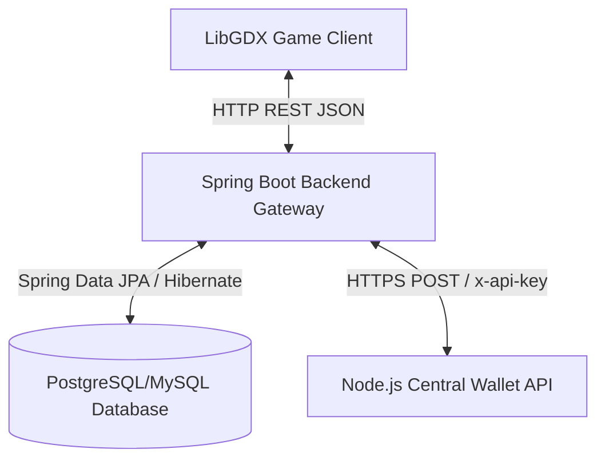

*   **Frontend Client**: Processes real-time overworld graphics, player state mutations, collision boxes, and turn-based battle rendering at a target 60 FPS.
*   **Spring Boot Backend**: Exposes REST controllers for user onboarding, gacha pity calculations, party ownership audits, and currency checkouts.
*   **Central Wallet API**: A Node.js microservice maintaining user balances of Jigsaw Coins. Transactions are processed with strict header-based authentication.

---

## 2. The Event Command System (Command Pattern)

Handling complex cutscenes, map triggers, dialogues, and scripted movement sequences within an overworld main loop requires a decoupled system. Chordius implements the **Command Pattern** using the [EventCommand](file:///c:/Users/Jesaya/Documents/OOP/Final%20Project/Finpro-OOP-kelompok-5/Frontend/core/src/main/java/com/chronicorn/frontend/eventcommands/EventCommand.java) interface and [EventManager](file:///c:/Users/Jesaya/Documents/OOP/Final%20Project/Finpro-OOP-kelompok-5/Frontend/core/src/main/java/com/chronicorn/frontend/managers/eventManagers/EventManager.java).

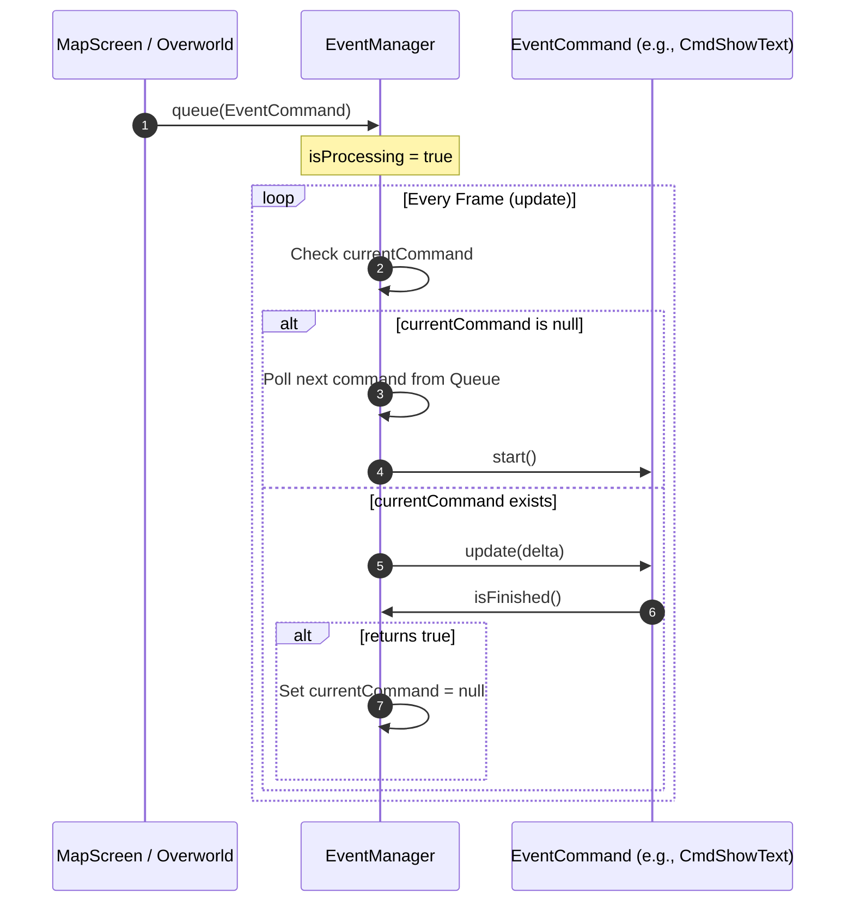

### The Mechanism
1. **The Interface**: [EventCommand](file:///c:/Users/Jesaya/Documents/OOP/Final%20Project/Finpro-OOP-kelompok-5/Frontend/core/src/main/java/com/chronicorn/frontend/eventcommands/EventCommand.java) declares three lifecycle methods:
    *   `start()`: Invoked once when the command reaches the head of the execution queue.
    *   `update(float delta)`: Invoked frame-by-frame to animate or tick properties.
    *   `isFinished()`: Returns a boolean indicating whether the command has completed its task.
2. **The Invoker**: [EventManager](file:///c:/Users/Jesaya/Documents/OOP/Final%20Project/Finpro-OOP-kelompok-5/Frontend/core/src/main/java/com/chronicorn/frontend/managers/eventManagers/EventManager.java) holds an `Array<EventCommand> commandQueue`. During the overworld game loop update:
    *   It checks if a command is currently running. If not, it pops the next command, calls `start()`, and flags itself as active.
    *   It ticks the active command's `update(delta)` method.
    *   When `isFinished()` returns `true`, the active reference is reset to `null`, allowing the next command to execute on the subsequent frame.

> [!NOTE]
> This pattern allows writing procedural sequences (e.g., Fade out screen $\rightarrow$ Move player to coordinates $\rightarrow$ Show text dialog $\rightarrow$ Fade in screen) asynchronously without blocking the render thread.

---

## 3. EventMap & Object Instantiation (Factory Pattern)

Overworld maps are designed in Tiled Map Editor and loaded as TMX assets. These maps are parsed by [TileMapManager](file:///c:/Users/Jesaya/Documents/OOP/Final%20Project/Finpro-OOP-kelompok-5/Frontend/core/src/main/java/com/chronicorn/frontend/managers/mapManager/TileMapManager.java) at runtime. Tiled map objects represent logic triggers and physical entities.

The instantiation of interactive objects from raw Tiled properties is managed using the **Factory Pattern** via [ObjectFactory](file:///c:/Users/Jesaya/Documents/OOP/Final%20Project/Finpro-OOP-kelompok-5/Frontend/core/src/main/java/com/chronicorn/frontend/objects/ObjectFactory.java).

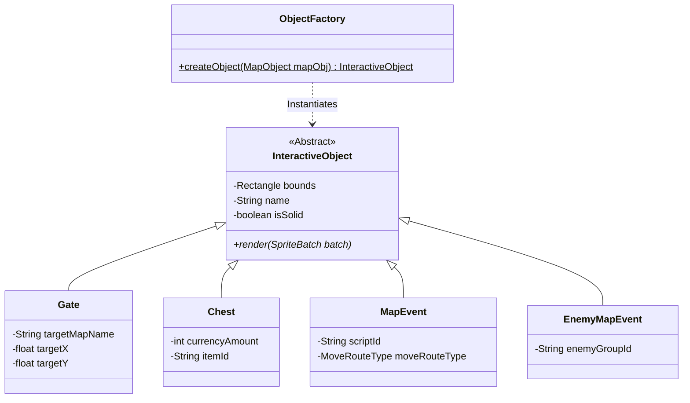

### Map Object Loading Workflow
1. The `Objects` layer in TMX maps is scanned. Each `MapObject` contains custom properties.
2. [TileMapManager](file:///c:/Users/Jesaya/Documents/OOP/Final%20Project/Finpro-OOP-kelompok-5/Frontend/core/src/main/java/com/chronicorn/frontend/managers/mapManager/TileMapManager.java) passes the `MapObject` to `ObjectFactory.createObject()`.
3. The factory parses the object type using the `class` or `type` property:
    *   **Gate**: Transition zone. Instantiated with `targetX`, `targetY`, and target map string properties.
    *   **Lever**: Interactive switch linked to trigger logic.
    *   **Chest**: Containers configured with `currency_amount` and `item_id` properties.
    *   **MapEvent**: Scripted NPC/overworld entities holding a `script_id` and autonomous routing arrays (e.g. directions `UP`, `DOWN`, `L` for LEFT, `R` for RIGHT, or actions like `LOOK_LEFT`).
    *   **EnemyMapEvent**: Triggers a battle transition based on an `enemy_group_id` property when a player enters its bounding box.
    *   **Vase**: Regional breakable decoration objects.

---

## 4. Battle System Engine & Turn Orchestration

The turn-based combat system is managed by [BattleManager](file:///c:/Users/Jesaya/Documents/OOP/Final%20Project/Finpro-OOP-kelompok-5/Frontend/core/src/main/java/com/chronicorn/frontend/managers/battleManager/BattleManager.java). It orchestrates combat steps, target selection, and action queues.

### The Turn State Machine
Combat executes through a finite state machine governed by the `TurnState` enum:

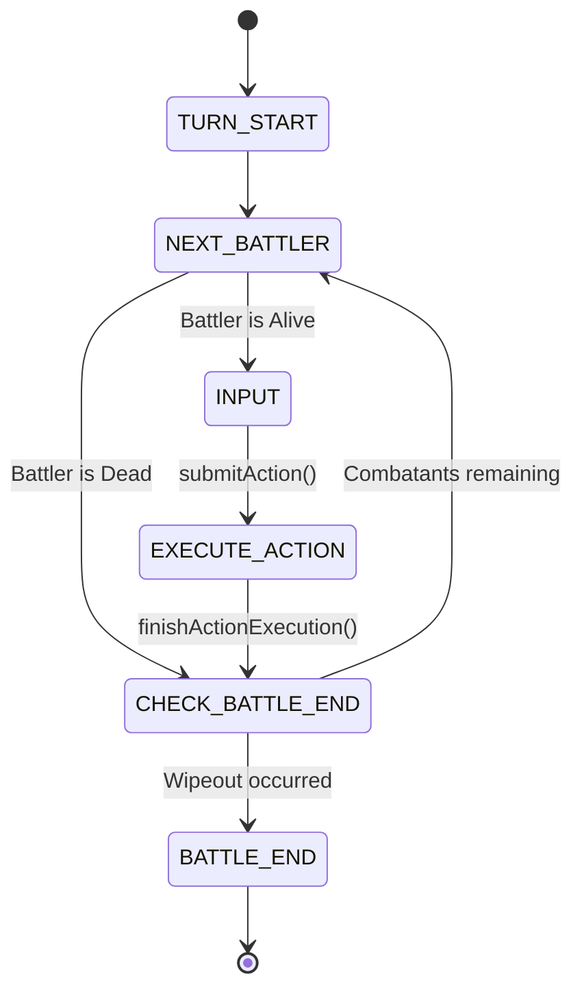

1.  **TURN_START**: Clears the queue. Scans all living `Battler` entities (both `Actor` party members and `Enemy` troop members), triggers their start-of-turn status ticks, and sorts the `turnQueue` descending by Speed (`getSpeed()`).
2.  **NEXT_BATTLER**: Removes the first `Battler` from the queue. If they are alive, triggers `triggerActionStart()`, and transitions to `INPUT`.
3.  **INPUT**: Halts execution. If the battler is player-controlled, waits for user selection via Scene2D buttons. If it is an enemy, calculates their AI logic. Calls `submitAction(Action)` when done.
4.  **EXECUTE_ACTION**: The engine calls `Action.execute()`, which applies damage or status modifications. It then checks the follow-up queue. If there are pending actions, it immediately pops and executes them.
5.  **CHECK_BATTLE_END**: Evaluates if the party or all enemies have 0 HP. If not, loops back to `NEXT_BATTLER`.

---

### Action & Reaction Actions
Actions in combat are modeled as command payloads:
*   [Action](file:///c:/Users/Jesaya/Documents/OOP/Final%20Project/Finpro-OOP-kelompok-5/Frontend/core/src/main/java/com/chronicorn/frontend/skills/Action.java): Represents a skill used by an actor or enemy. It holds references to the `user`, `skill`, the target selection (`primaryTarget`), and resolved secondary targets based on the skill's scope (e.g. `ALL_ENEMIES`, `SINGLE_ALLY`).
*   [ReactionAction](file:///c:/Users/Jesaya/Documents/OOP/Final%20Project/Finpro-OOP-kelompok-5/Frontend/core/src/main/java/com/chronicorn/frontend/skills/ReactionAction.java): A specialized subclass of `Action`. It is spawned dynamically by the reaction system, has no owning user (`super(null)`), and bypasses default stat scaling and skill logic execution. Instead, it applies a pre-calculated flat damage payload directly to targets in its `execute()` call.

---

### Elemental Engine & Reactions
The [ElementalEngine](file:///c:/Users/Jesaya/Documents/OOP/Final%20Project/Finpro-OOP-kelompok-5/Frontend/core/src/main/java/com/chronicorn/frontend/managers/battleManager/mechanics/ElementalEngine.java) manages elements, marks, and weakness breaks.

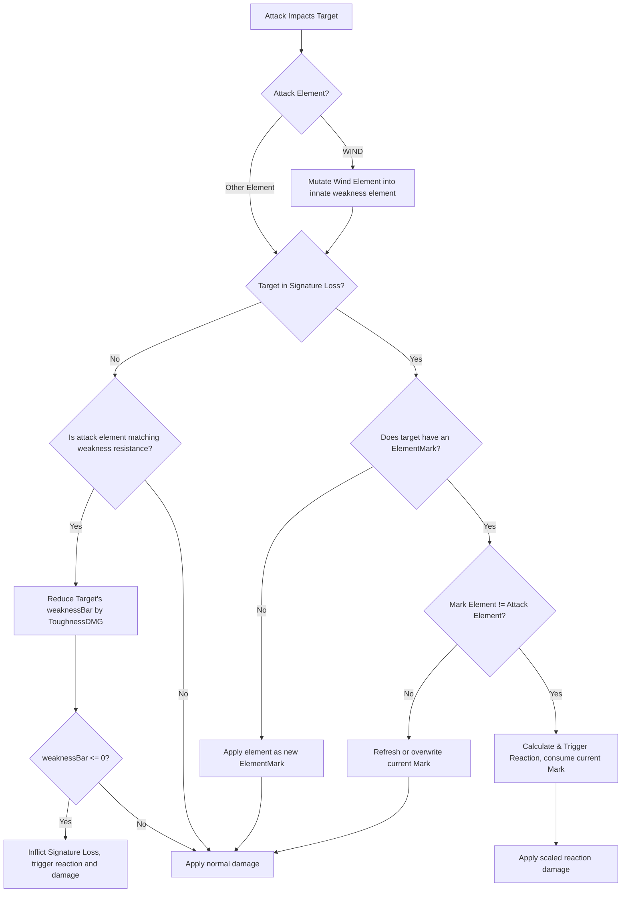

#### Wind Camouflage
If the attacking skill uses the `WIND` element, `determineWindMutation` converts the wind element into one of the target's innate element weaknesses, enabling wind skills to reliably target vulnerabilities.

#### Weakness & Break Checking
*   If the target is **not** in a state of **Signature Loss** (weakness bar active):
    *   The engine checks if the skill's element matches any of the target's weakness attributes (`isWeakness`).
    *   If yes, the target's `weaknessBar` is reduced by the skill's `ToughnessDMG`.
    *   If the `weaknessBar` drops to `0` or below, a **Break** triggers: target is placed in Signature Loss (`setSignatureLoss(true)`), and an elemental reaction matching the breaking element triggers immediately.

#### Signature Loss & Mark Consumption
*   If the target **is** in a state of **Signature Loss** (weakness bar broken):
    *   If the target is not currently marked, the attack applies the skill's element as a new `ElementMark`.
    *   If the target is already marked, and the incoming element is **different** from the mark:
        *   An elemental reaction is resolved using a lookup table in `getReaction(elementsHashMap)`.
        *   The mark is consumed and cleared from the target.
    *   If the element is the same, the mark duration or status is refreshed.

#### Reaction Formula & Effects
When two different elements react, the resulting reaction damage is calculated dynamically using the levels and Magic Attack (`MAT`) stats of the actors who applied the mark and triggered the reaction:

$$\text{Reaction Damage} = \left( \frac{\text{Level}_1 + \text{Level}_2}{5} + 2 \right) \times \text{Constant}_{\text{Reaction}} \times \left( \frac{\text{MAT}_1 + \text{MAT}_2}{\text{MDF}_{\text{Target}}} \right) \times 0.02 + 2$$

$$\text{Final Damage} = \text{Reaction Damage} \times (1 + \text{HiddenParam}_{\text{Target}}[0])$$

The primary reactions in Chordius are:
*   **Douse** (Fire + Water): Deals $1.5\times$ amplified damage.
*   **Evaporate** (Water + Fire): Deals $1.5\times$ amplified damage.
*   **Smothered** (Fire + Earth): Inflicts the `smothered` status, reducing target's Attack by $50\%$.
*   **Overload** (Fire + Lightning): Spawns an explosive AoE attack hitting all adjacent combatants.
*   **Muddied** (Water + Earth): Inflicts the `muddied` status, reducing target's Speed by $33\%$.
*   **Electrocute** (Water + Lightning): Inflicts a damage-over-time `electrocuted` status.
*   **Burn** (Earth + Fire): Inflicts a damage-over-time `burn` status.
*   **Damp** (Earth + Water): Inflicts the `damp` status, reducing target's Defense by $33\%$.
*   **Isolate** (Lightning + Earth): Inflicts the `isolate` status, stunning the target for $3$ turns.

---

### Interrupting Actions (BattleDelegate)
The [BattleDelegate](file:///c:/Users/Jesaya/Documents/OOP/Final%20Project/Finpro-OOP-kelompok-5/Frontend/core/src/main/java/com/chronicorn/frontend/managers/battleManager/BattleDelegate.java) interface decouples the individual battler entities from the orchestrating `BattleManager`.

When a reaction or follow-up is triggered at the battler level:
1.  The battler class calls its delegate: `battleDelegate.onReactionRequested(...)` or `onFollowUpRequested(...)`.
2.  The delegate callback instantiates a new action, resolves its targets, and appends it to the manager's `followUpQueue`.
3.  Once the current turn execution finishes, the `BattleManager` executes the follow-up actions before letting the turn cycle continue.

---

## 5. Data-Driven Architecture & Runtime Registries

To balance flexibility and performance, the client reads base databases from external JSON files while resolving complex, custom behaviors through structural design registries.

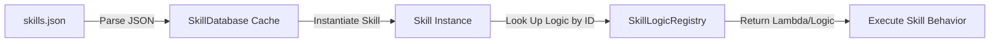

### JSON Base Databases
Assets such as skills are stored in [skills.json](file:///c:/Users/Jesaya/Documents/OOP/Final%20Project/Finpro-OOP-kelompok-5/Frontend/core/assets/data/skills.json). This file contains static attributes:
*   Name, description, icon textures.
*   Element types and target scope parameters.
*   Base calculations (damage constants, mana costs).

[SkillDatabase](file:///c:/Users/Jesaya/Documents/OOP/Final%20Project/Finpro-OOP-kelompok-5/Frontend/core/src/main/java/com/chronicorn/frontend/skills/SkillDatabase.java) parses the JSON file at startup and caches the raw node structure (`JsonValue`) in memory. When a unit gains or casts a skill, `SkillDatabase.get(skillId)` instantiates a fresh [Skill](file:///c:/Users/Jesaya/Documents/OOP/Final%20Project/Finpro-OOP-kelompok-5/Frontend/core/src/main/java/com/chronicorn/frontend/skills/Skill.java) object.

---

### Dynamic Logic Workarounds (Registry Pattern)
To handle complex, unique card skills (e.g. Deal's marking mode, Reyna's party lifesteal splash, Porter's critical modifiers) without writing a complex custom script interpreter, the game combines the data with the **Registry Pattern**:
*   [SkillLogicRegistry](file:///c:/Users/Jesaya/Documents/OOP/Final%20Project/Finpro-OOP-kelompok-5/Frontend/core/src/main/java/com/chronicorn/frontend/skills/SkillLogicRegistry.java) maintains a global hash map mapping skill string IDs to compiled Java logic implementations.
*   Each entry implements the `SkillLogic` interface, defining lifecycle functions like `before()` and `execute()`.
*   At runtime, the instantiated `Skill` object queries `SkillLogicRegistry.getLogic(skillId)` to resolve its custom logic.

A similar registry is used for map scripting:
*   [ScriptRegistry](file:///c:/Users/Jesaya/Documents/OOP/Final%20Project/Finpro-OOP-kelompok-5/Frontend/core/src/main/java/com/chronicorn/frontend/managers/eventManagers/ScriptRegistry.java) maps loaded Tiled map names to compiled [MapScript](file:///c:/Users/Jesaya/Documents/OOP/Final%20Project/Finpro-OOP-kelompok-5/Frontend/core/src/main/java/com/chronicorn/frontend/scripts/MapScript.java) classes (e.g. `CherryTownScript`, `Jail1BScript`), routing trigger events from the physics engine to the appropriate map scripts.

---

## 6. Player Movement & Animation States (State Pattern)

Player overworld physics, input mapping, and animations are managed using the **State Pattern**. This keeps the player controller flexible and easy to extend.

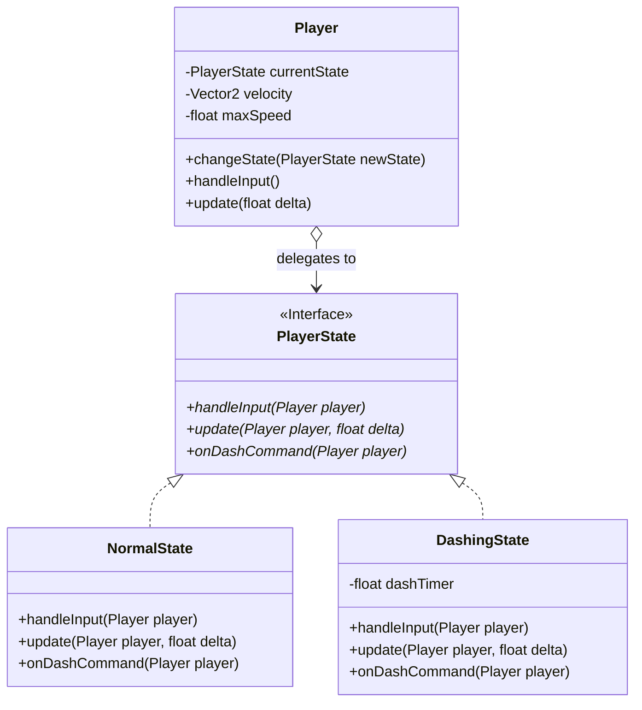

### State Switching Architecture
*   The [Player](file:///c:/Users/Jesaya/Documents/OOP/Final%20Project/Finpro-OOP-kelompok-5/Frontend/core/src/main/java/com/chronicorn/frontend/Player.java) context class holds a reference to a `PlayerState` instance (defaulting to [NormalState](file:///c:/Users/Jesaya/Documents/OOP/Final%20Project/Finpro-OOP-kelompok-5/Frontend/core/src/main/java/com/chronicorn/frontend/states/NormalState.java)).
*   Input polling and update loops are delegated to the active state:
    *   **NormalState**: Listens for WASD inputs, sets movement direction, and checks if the run/dash key is pressed. If `SHIFT` is held, it calls `player.changeState(new DashingState())`.
    *   **DashingState**: Overrides input velocity scaling, applies a multiplier to speed, and spawns motion trail sprites. Once the dash duration expires, it transitions back to `NormalState`.

---

## 7. Complex Interactable UIs (Observer & Listener Patterns)

The UI layers in Chordius use the **Listener Pattern** and the **Observer Pattern** to handle user interactions and keep game data separated from rendering.

### Listener Pattern (Scene2D Elements)
Visual interactions like mouse clicks, card selections, or dragging objects are captured using Scene2D listeners. Classes like `ActorCardUI` implement custom inputs:
```java
cardActor.addListener(new ClickListener() {
    @Override
    public void clicked(InputEvent event, float x, float y) {
        // Triggers UI transitions or target selection
    }
});
```

---

### Observer Pattern (Player Observability)
To prevent the `Player` class from directly depending on UI widgets (like health bars, cooldown timers, or status icons), the player class acts as a subject in the **Observer Pattern**.

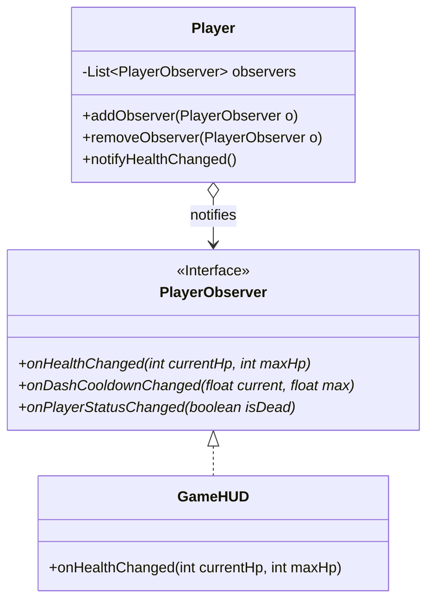

*   Observers implement the [PlayerObserver](file:///c:/Users/Jesaya/Documents/OOP/Final%20Project/Finpro-OOP-kelompok-5/Frontend/core/src/main/java/com/chronicorn/frontend/observers/PlayerObserver.java) interface.
*   When the player takes damage, dashes, or dies, the player object loops through its registered observers and triggers their updates (e.g. `onHealthChanged`).
*   This allows the user interface to respond to player state changes without having to poll values every frame.

---

## 8. Singleton Managers Architecture

System components in the frontend are managed by singletons to ensure global access and clean lifecycle management:

1.  **ImageManager**: Manages visual assets. Caches `Texture`, `TextureRegion`, and Scene2D UI skins to prevent memory leaks from duplicate resource allocations.
2.  **LevelMapManager**: Coordinates map load requests, active camera tracking bounds, and overworld drawing sequences.
3.  **TileMapManager**: Handles overworld maps. Parses physical collisions, hazard regions (like lava or spikes), and interactive Tiled objects.
4.  **GameSession**: Global state container. Tracks the active party, inventory, speedrun timer, and triggered quest variables or flags.
5.  **NetworkManager**: Coordinates REST communication with the backend, managing user auth, pity counts, and transactional checks.
6.  **SceneManager**: Manages screen transitions (e.g., swapping between `TitleScreen`, `MapScreen`, and `BattleScreen`) and disposes of unused screen memory.

---

## 9. Interface-as-Abstraction & Delegation

Using interfaces as abstractions helps keep code decoupled. A key example of this is the battle delegation model:

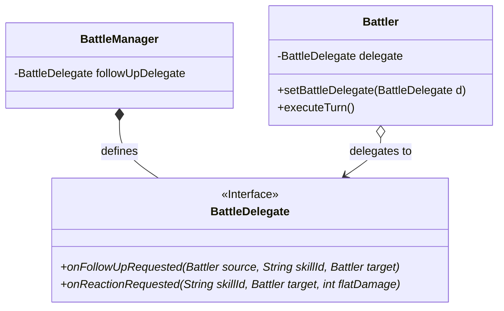

*   The combatants (`Battler`) do not hold direct references to `BattleManager`.
*   If a battler triggers a status reaction or follow-up skill, it delegates the request through `BattleDelegate`.
*   This interface hides the internal queues of `BattleManager` from the battlers, keeping the logic clean and easy to test.

---

## 10. Backend Proxy Architecture & Wallet Integration

The backend is built as a REST API gateway using **Spring Boot 3**. It handles game-specific requests and proxies wallet operations to a Node.js Wallet API.

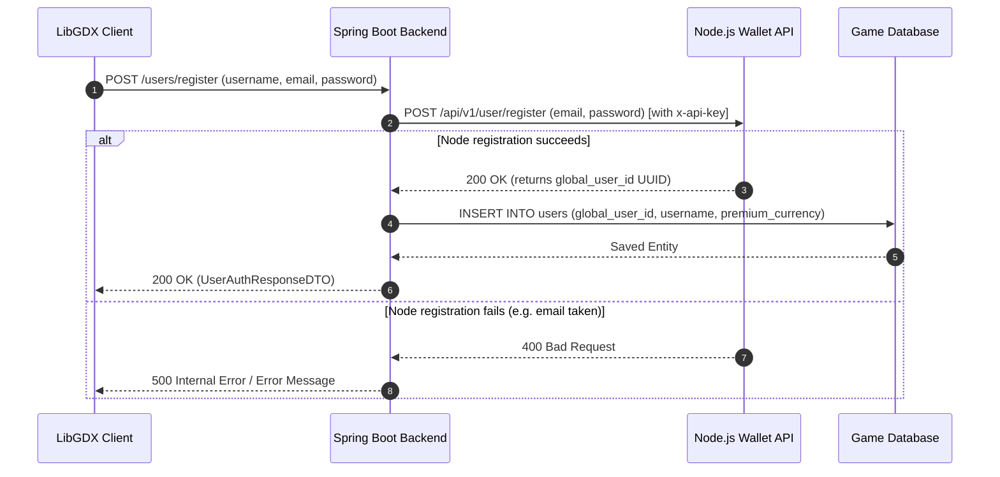

### The Proxy Pattern
1.  **Registration/Login**: The backend does not store passwords locally. Instead, the credentials are proxied to Node.js. Upon success, Spring Boot links the returned `global_user_id` (UUID) to a local user record in the game database.
2.  **Jigsaw Coin Transactions**: The `PaymentService` manages Jigsaw Coin purchases:
    *   Creates a `PENDING` order in `local_orders`.
    *   Sends a POST transaction request to Node.js containing the cost and order reference.
    *   The transaction cost is sent as a negative decimal (e.g., `-cost`) to securely deduct coins.
    *   If the wallet API responds with success, the order is updated to `COMPLETED`, and the user's premium currency is updated in the local database.

---

## 11. Save/Reset System & Local Data Integrity Check

To prevent players from modifying local save files (e.g., adding unowned 5-star characters), the client performs an integrity check during the save loading sequence.

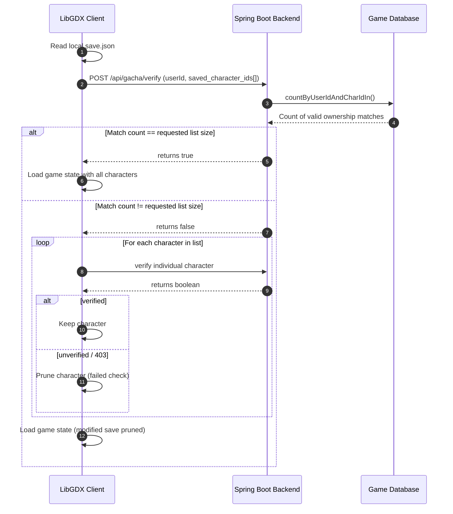

1.  **Serialization**: Overworld coordinates, quest flags, and character rosters are saved locally as `save.json` using Gdx's Json engine.
2.  **Bulk Verification**: On load, the client extracts the saved character IDs and sends them to the backend endpoint `/api/gacha/verify`.
3.  **Database Audit**: The backend queries the database using JPA's `countByUserIdAndCharIdIn` to confirm that the user actually owns all the characters in the save file.
4.  **Individual Validation & Pruning**:
    *   If the check fails (returns `false` or `403`), the client verifies each character individually.
    *   Any character that fails verification is pruned from the active roster, preventing save file manipulation.
5.  **Offline Fallback**: If a connection timeout occurs (not a `403`), the client trusts the local save file to preserve offline playability.

---

## 12. Spring Boot Backend Architecture & Database ERD

The backend codebase uses standard layers to isolate database and presentation logic:

*   **Controllers**: Map REST endpoints to service methods.
*   **Services**: Handle business logic, transaction management (`@Transactional`), and external API calls.
*   **Repositories**: Spring Data JPA interfaces that map database queries to Java objects.

### Database Relational Schema (ERD)

The database schema manages user profiles, pity counters, character ownership, and order logs:

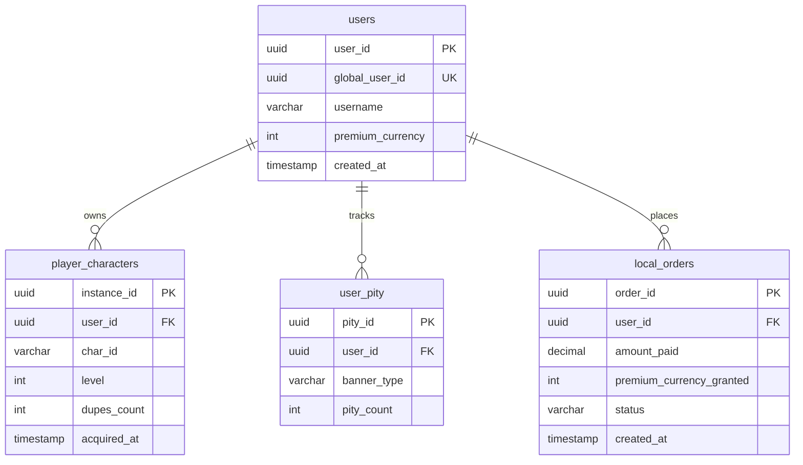

*   **users**: Holds user profiles and premium currency totals.
*   **player_characters**: Tracks character levels and duplicates acquired via gacha.
*   **user_pity**: Stores user gacha pity counters per banner type (e.g. standard).
*   **local_orders**: Logs purchase transaction statuses (`PENDING`, `COMPLETED`, `FAILED`, `ERROR`).

---

## 13. Gacha Instantiation (Factory Pattern)

Creating and maintaining gameplay actors in a multi-platform JVM game client requires a reliable, decoupled connection between state data stored on the backend and polymorphic classes running on the client. To achieve this, the game combines a Spring Boot transactional database flow with a client-side **Factory Pattern** implemented via [ActorFactory](file:///c:/Users/Jesaya/Documents/OOP/Final%20Project/Finpro-OOP-kelompok-5/Frontend/core/src/main/java/com/chronicorn/frontend/battlers/ActorFactory.java).

### The Instantiation Pipeline

When a user pulls characters on a banner, the data flows through client UI triggers, asynchronous REST proxy controllers, database updates, and finally polymorphic instantiation:

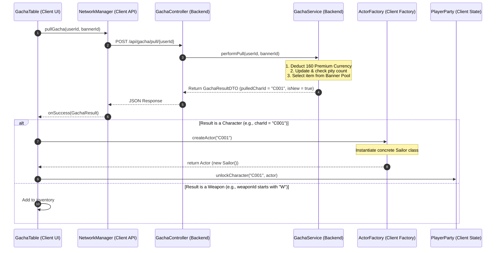

### Component Details

1. **Client Trigger**: In [GachaTable.java](file:///c:/Users/Jesaya/Documents/OOP/Final%20Project/Finpro-OOP-kelompok-5/Frontend/core/src/main/java/com/chronicorn/frontend/screens/components/GachaTable.java#L272-L392), clicking the "1x Recruit" or "10x Recruit" button triggers a network call using the [NetworkManager](file:///c:/Users/Jesaya/Documents/OOP/Final%20Project/Finpro-OOP-kelompok-5/Frontend/core/src/main/java/com/chronicorn/frontend/managers/networkManager/NetworkManager.java#L85-L142).
2. **Backend Resolution**: The [GachaController](file:///c:/Users/Jesaya/Documents/OOP/Final%20Project/Finpro-OOP-kelompok-5/Backend/src/main/java/com/chronicorn/backend/controller/GachaController.java) delegating to [GachaService](file:///c:/Users/Jesaya/Documents/OOP/Final%20Project/Finpro-OOP-kelompok-5/Backend/src/main/java/com/chronicorn/backend/services/GachaService.java) executes a transactional workflow:
   * Deducts the currency from the user account.
   * Increments the user pity count.
   * Queries the database banner pools to select a character/weapon depending on pity counters and random rates.
   * Saves character ownership record in the `player_characters` table.
   * Sends the resulting identifier code (e.g., `"C001"`, `"C002"`) back to the client.
3. **Factory Instantiation**: The client receives the character code and calls the factory:
   ```java
   Actor actor = ActorFactory.createActor(result.pulledCharId);
   ```
   Inside [ActorFactory.java](file:///c:/Users/Jesaya/Documents/OOP/Final%20Project/Finpro-OOP-kelompok-5/Frontend/core/src/main/java/com/chronicorn/frontend/battlers/ActorFactory.java#L10-L28), a simple switch matches the string ID and returns a new subclass of `Actor`:
   * `"C001"` $\rightarrow$ `new Sailor()`
   * `"C002"` $\rightarrow$ `new Porter()`
   * `"C003"` $\rightarrow$ `new Reyna()`
   * `"C004"` $\rightarrow$ `new Deal()`

### Benefits of the Factory Pattern here
* **Decoupling Data from Logic**: The database and API only need to understand flat string codes (like `"C001"`), while the client-side game logic handles the highly complex JVM class hierarchies, assets, and combat parameters.
* **Polymorphism**: The `GachaTable` and `PlayerParty` code can treat all recruits uniformly as the abstract `Actor` base class without knowing their exact subclass type, rendering behaviors, elements, or combat actions.
* **Maintainability**: Adding a new character class is as simple as defining the new actor subclass and registering it in [ActorFactory](file:///c:/Users/Jesaya/Documents/OOP/Final%20Project/Finpro-OOP-kelompok-5/Frontend/core/src/main/java/com/chronicorn/frontend/battlers/ActorFactory.java)'s switch statement.
